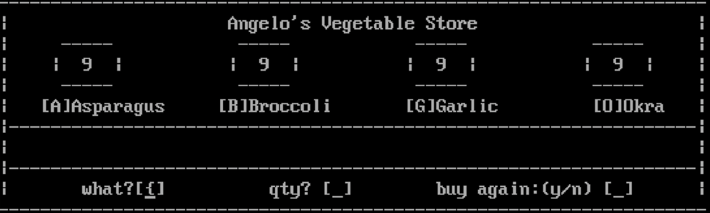

# asm-codes
Simple ASM Codes (2012)

---
### Repository Contents

 

<b> Angelo's Store</b>

  * Run Preview: [via linkedin.com/in/angeloparayno](https://www.linkedin.com/posts/angeloparayno_after-all-the-ai-chatgpt-google-bard-activity-7044446734051147776-puxD?utm_source=share&utm_medium=member_desktop)
  * Sample Output:

  * Last Updated: 03/2023 (replaced utf-8 characters that are not working)

 
---
#### How to Run the **.ASM** File
1. Use VS Code
2. Install the extension **MASM/TASM** by **clcxsrolau** to run **.asm** file
3. Run
